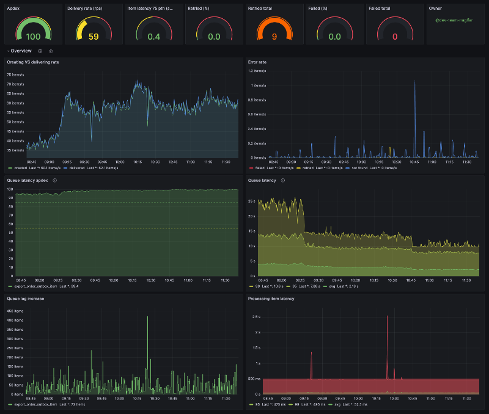

[](https://badge.fury.io/rb/sbmt-outbox)
[](https://github.com/SberMarket-Tech/sbmt-outbox/actions?query=branch%3Amaster)

# Sbmt-Outbox


Microservices often publish messages after a transaction has been committed. Writing to the database and publishing a message are two separate transactions, so they must be atomic. A failed publication of a message could lead to a critical failure of the business process.

The Outbox pattern provides a reliable solution for message publishing. The idea behind this approach is to have an "outgoing message table" in the service's database. Before the main transaction completes, a new message row is added to this table. As a result, two actions take place as part of a single transaction. An asynchronous process retrieves new rows from the database table and, if they exist, publishes the messages to the broker.

## Installation

Add this line to your application's Gemfile:

```ruby
gem "sbmt-outbox"
```

And then execute:

```shell
bundle install
```

## Demo

Learn how to use this gem and how it works with Ruby on Rails at here https://github.com/SberMarket-Tech/outbox-example-apps

## Auto configuration

We recommend going through the configuration and files creation process using the following Rails generators:

Each generator can be run by using the `--help` option to learn more about the available arguments.

### Initial configuration

If you plug the gem into your application for the first time, you can generate the initial configuration:

```shell
rails g outbox:install
```

### Outbox/inbox items creation

An ActiveRecord model can be generated for the outbox/ inbox item like this:

```shell
rails g outbox:item MaybeNamespaced::SomeOutboxItem --kind outbox
rails g outbox:item MaybeNamespaced::SomeInboxItem --kind inbox
```

As the result, a migration and a model will be created and the `outbox.yml` file configured.

### Transport creation

A transport is a class that is invoked while processing a specific outbox or inbox item. The transport must return either a boolean value or a dry monad result.

```shell
rails g outbox:transport MaybeNamespaced::SomeOutboxItem some/transport/name --kind outbox
rails g outbox:transport MaybeNamespaced::SomeInboxItem some/transport/name --kind inbox
```

## Usage

To create an Outbox item, you should call the Interactor with the Item Model Class and `event_key` as arguments. The latter will be the Partitioning Key.

```ruby
transaction do
  some_record.save!

  result = Sbmt::Outbox::CreateOutboxItem.call(
    MyOutboxItem,
    event_key: some_record.id,
    attributes: {
      payload: some_record.generate_payload,
      options: {
        key: some_record.id, # optional, may be used when producing to a Kafka topic
        headers: {'FOO_BAR' => 'baz'} # optional, you can add custom headers
      }
    }
  )

  raise result.failure unless result.success?
end
```

## Monitoring

We use [Yabeda](https://github.com/yabeda-rb/yabeda) to collect [all kind of metrics](./config/initializers/yabeda.rb).

Example of a Grafana dashboard that you can import [from a file](./examples/grafana-dashboard.json):



[Full picture](./examples/outbox-grafana.png)

## Manual configuration

### `Outboxfile`

First of all you shoudl create an `Outboxfile` at the root of your application with the following code:

```ruby
# frozen_string_literal: true

require_relative "config/environment"

# Comment out this line if you don't want to use a metrics exporter
Yabeda::Prometheus::Exporter.start_metrics_server!
```

### `config/initializers/outbox.rb`

The `config/initializers/outbox.rb` file contains the overall general configuration.

```ruby
# config/initializers/outbox.rb

Rails.application.config.outbox.tap do |config|
  config.redis = {url: ENV.fetch("REDIS_URL")} # Redis is used as a coordinator service
  config.paths << Rails.root.join("config/outbox.yml").to_s # optional; configuration file paths, deep merged at the application start, useful with Rails engines

  # optional (worker v2: default)
  c.poller = ActiveSupport::OrderedOptions.new.tap do |pc|
    # max parallel threads (per box-item, globally)
    pc.concurrency = 6
    # max threads count (per worker process)
    pc.threads_count = 1
    # maximum processing time of the batch, after which the batch will be considered hung and processing will be aborted
    pc.general_timeout = 60
    # poll buffer consists of regular items (errors_count = 0, i.e. without any processing errors) and retryable items (errors_count > 0)
    # max poll buffer size = regular_items_batch_size + retryable_items_batch_size
    pc.regular_items_batch_size = 200
    pc.retryable_items_batch_size = 100

    # poll tactic: default is optimal for most cases: rate limit + redis job-queue size threshold
    # poll tactic: aggressive is for high-intencity data: without rate limits + redis job-queue size threshold
    # poll tactic: low-priority is for low-intencity data: rate limits + redis job-queue size threshold + + redis job-queue lag threshold
    pc.tactic = "default"
    # number of batches that one thread will process per rate interval
    pc.rate_limit = 60
    # rate interval in seconds
    pc.rate_interval = 60
    # mix / max redis job queue thresholds per box-item for default / aggressive / low-priority poll tactics
    pc.min_queue_size = 10
    pc.max_queue_size = 100
    # min redis job queue time lag threshold per box-item for low-priority poll tactic (in seconds)
    pc.min_queue_timelag = 5
    # throttling delay for default / aggressive / low-priority poll tactics (in seconds)
    pc.queue_delay = 0.1
  end

  # optional (worker v2: default)
  c.processor = ActiveSupport::OrderedOptions.new.tap do |pc|
    # max threads count (per worker process)
    pc.threads_count = 4
    # maximum processing time of the batch, after which the batch will be considered hung and processing will be aborted
    pc.general_timeout = 120
    # BRPOP delay (in seconds) for polling redis job queue per box-item
    pc.brpop_delay = 2
  end

  # optional (worker v1: DEPRECATED)
  config.process_items.tap do |x|
    # maximum processing time of the batch, after which the batch will be considered hung and processing will be aborted
    x.general_timeout = 180
    # maximum batch processing time, after which the processing of the batch will be aborted in the current thread,
    # and the next thread that picks up the batch will start processing from the same place
    x.cutoff_timeout = 60
    # batch size
    x.batch_size = 200
  end

  # optional (worker v1: DEPRECATED)
  config.worker.tap do |worker|
    # number of batches that one thread will process per rate interval
    worker.rate_limit = 10
    # rate interval in seconds
    worker.rate_interval = 60
  end
end
```

### Outbox pattern

You should create a database table in order for the process to view your outgoing messages.

```ruby
create_table :my_outbox_items do |t|
  t.uuid :uuid, null: false
  t.string :event_name, null: false # optional, use it when you have several events per one outbox table
  t.string :event_key, null: false
  t.integer :bucket, null: false
  t.integer :status, null: false, default: 0
  t.jsonb :options
  t.binary :payload, null: false # when using mysql the column type should be mediumblob
  t.integer :errors_count, null: false, default: 0
  t.text :error_log
  t.timestamp :processed_at
  t.timestamps
end

add_index :my_outbox_items, :uuid, unique: true
add_index :my_outbox_items, [:status, :bucket, :errors_count]
add_index :my_outbox_items, [:event_name, :event_key, :id]
add_index :my_outbox_items, :created_at
```

You can combine various types of messages within a single table. To do this, you should include an `event_name` field in the table. However, this approach is only justified if it is assumed that there won't be many events, and those events will follow the same retention and retry policy.

```ruby
# app/models/my_outbox_item.rb
class MyOutboxItem < Sbmt::Outbox::OutboxItem
  validates :event_name, presence: true # optional
end
```

#### outbox.yml
The `outbox.yml` configuration file is the main configuration for the gem, where parameters for each outbox/inbox item are located.

```yaml
# config/outbox.yml
default: &default
  owner: foo-team # optional, used in Yabeda metrics
  bucket_size: 16 # optional, default 16, see into about the buckets at the #Concurrency section
  metrics:
    enabled: true # default false, yabeda server autostart with port: 9090 and path: /metrics
    port: 9090 # optional, default, used in Yabeda metrics
  probes:
    enabled: false # optional, default true
    port: 5555 # default, used for Kubernetes probes

  outbox_items: # outbox items section
    my_outbox_item: # underscored model class name
      owner: my_outbox_item_team # optional, used in Yabeda metrics
      retention: P1W # retention period, https://en.wikipedia.org/wiki/ISO_8601#Durations
      max_retries: 3 # default 0, the number of retries before the item will be marked as failed
      transports: # transports section
        produce_message: # underscored transport class name
          # transport reserved options
          class: produce_message # optional; default is inferred from transport name
          disposable: false # optional; default false; if true, the transport class will be instantiated only once
          # ProduceMessage instance arguments
          topic: "my-topic-name"

development:
  <<: *default

test:
  <<: *default
  bucket_size: 2

production:
  <<: *default
  bucket_size: 256
```

```ruby
# app/services/import_order.rb
class ProduceMessage
  def initialize(topic:)
    @topic = topic
  end

  def call(outbox_item, payload)
    # send message to topic
    true # mark message as processed
  end
end
```

**If you use Kafka as a transport, it is recommended that you use the [`sbmt-kafka_producer`](https://github.com/SberMarket-Tech/sbmt-kafka_producer) gem for this purpose.**

Transports are defined as follows when `event_name` is used:

```yaml
outbox_items:
  my_outbox_item:
    transports:
        # transport reserved options
      - class: produce_message
        event_name: "order_created" # event name marker
        # ProduceMessage instance arguments
        topic: "order_created_topic" # some transport argument
      - class: produce_message
        event_name: "orders_completed"
        topic: "orders_completed_topic"
```

### Inbox pattern

The database migration will be the same as described in the Outbox pattern.

```ruby
# app/models/my_inbox_item.rb
class MyInboxItem < Sbmt::Outbox::InboxItem
end
```

```yaml
# config/outbox.yml
# see main configuration at the Outbox pattern
inbox_items: # inbox items section
  my_inbox_item: # underscored model class name
    owner: my_inbox_item_team # optional, used in Yabeda metrics
    retention: P1W # retention period, https://en.wikipedia.org/wiki/ISO_8601#Durations
    max_retries: 3 # default 0, the number of retries before the item will be marked as failed
    transports: # transports section
      import_order: # underscored transport class name
        source: "kafka" # default transport arguments
```

```ruby
# app/services/import_order.rb
class ImportOrder
  def initialize(source:)
    @source = source
  end

  def call(outbox_item, payload)
    # some work to create order in the database
    true # mark message as processed
  end
end
```

**If you use Kafka, it is recommended that you use the [`sbmt-kafka_consumer`](https://github.com/SberMarket-Tech/sbmt-kafka_consumer) gem for this purpose.**

### Retry strategies

The gem uses several types of retry strategies to repeat message processing if an error occurs. These strategies can be combined and will be executed one after the other. Each retry strategy takes one of three actions: to process the message, to skip processing the message or to skip processing and mark the message as "skipped" for future processing.

#### Exponential backoff

This strategy periodically attempts to resend failed messages, with increasing delays in between each attempt.

```yaml
# config/outbox.yml
outbox_items:
  my_outbox_item:
    ...
    minimal_retry_interval: 10 # default: 10
    maximal_retry_interval: 600 # default: 600
    multiplier_retry_interval: 2 # default: 2
    retry_strategies:
      - exponential_backoff
```

#### Latest available

This strategy ensures idempotency. In short, if a message fails and a later message with the same event_key has already been delivered, then you most likely do not want to re-deliver the first one when it is retried.

```yaml
# config/outbox.yml
outbox_items:
  my_outbox_item:
    ...
    retry_strategies:
      - exponential_backoff
      - latest_available
```

The exponential backoff strategy should be used in conjunction with the latest available strategy, and it should come last to minimize the number of database queries.

### Partition strategies

Depending on which type of data is used in the `event_key`, it is necessary to choose the right partitioning strategy.

#### Number partitioning

This strategy should be used when the `event_key` field contains a number. For example, it could be `52523`, or `some-chars-123`. Any characters that aren't numbers will be removed, and only the numbers will remain. This strategy is used as a default.

```yaml
# config/outbox.yml
outbox_items:
  my_outbox_item:
    ...
    partition_strategy: number
```

#### Hash partitioning

This strategy should be used when the `event_key` is a string or uuid.

```yaml
# config/outbox.yml
outbox_items:
  my_outbox_item:
    ...
    partition_strategy: hash
```

## Concurrency

The worker process consists of a poller and a processor, each of which has its own thread pool.
The poller is responsible for fetching messages ready for processing from the database table.
The processor, in turn, is used for their consistent processing (while preserving the order of messages and the partitioning key).
Each bunch of buckets (i.e. buckets partition) is consistently fetched by poller one at a time. Each bucket is processed one at a time by a processor.
A bucket is a number in a row in the `bucket` column generated by the partitioning strategy based on the `event_key` column when a message was committed to the database within the range of zero to `bucket_size`.
The number of bucket partitions, which poller uses is 6 by default. The number of poller threads is 2 by default and is not intended for customization.
The default number of processor threads is 4 and can be configured with the --concurrency option, thereby allowing you to customize message processing performance.
This architecture was designed to allow the daemons to scale without stopping the entire system in order to avoid mixing messages chronologically.

### Middlewares

You can wrap item processing within middlewares. There are three types:
- client middlewares – triggered outside of a daemon; executed alongside an item is created
- server middlewares – triggered inside a daemon; divided into two types:
  - batch middlewares – executed alongside a batch being fetched from the database
  - item middlewares – execute alongside an item during processing

The order of execution depends on the order specified in the outbox configuration:

```ruby
# config/initializers/outbox.rb
Rails.application.config.outbox.tap do |config|
  config.item_process_middlewares.push(
    'MyFirstItemMiddleware', # goes first
    'MySecondItemMiddleware' # goes second
  )
end
```

#### Client middlewares

```ruby
# config/initializers/outbox.rb
Rails.application.config.outbox.tap do |config|
  config.create_item_middlewares.push(
    'MyCreateItemMiddleware'
  )
end

# my_create_item_middleware.rb
class MyCreateItemMiddleware
  def call(item_class, item_attributes)
    # your code
    yield
    # your code
  end
end
```

#### Server middlewares

Example of a batch middleware:

```ruby
# config/initializers/outbox.rb
Rails.application.config.outbox.tap do |config|
  config.batch_process_middlewares.push(
    'MyBatchMiddleware'
  )
end

# my_batch_middleware.rb
class MyBatchMiddleware
  def call(job)
    # your code
    yield
    # your code
  end
end
```

Example of an item middleware:

```ruby
# config/initializers/outbox.rb
Rails.application.config.outbox.tap do |config|
  config.item_process_middlewares.push(
    'MyItemMiddleware'
  )
end

# my_create_item_middleware.rb
class MyItemMiddleware
  def call(item)
    # your code
    yield
    # your code
  end
end
```

## Tracing

The gem is optionally integrated with OpenTelemetry. If your main application has `opentelemetry-*` gems, the tracing will be configured automatically.

## Web UI

Outbox comes with a [Ract web application](https://github.com/SberMarket-Tech/sbmt-outbox-ui) that can list existing outbox and inbox models.

```ruby
Rails.application.routes.draw do
  mount Sbmt::Outbox::Engine => "/outbox-ui"
end
```

**The path `/outbox-ui` cannot be changed for now**

Under the hood it uses a React application provided as [npm package](https://www.npmjs.com/package/sbmt-outbox-ui).

By default, the npm packages is served from `https://cdn.jsdelivr.net/npm/sbmt-outbox-ui@x.y.z/dist/assets/index.js`. It could be changed by the following config option:
```ruby
# config/initializers/outbox.rb
Rails.application.config.outbox.tap do |config|
  config.cdn_url = "https://some-cdn-url"
end
```

### UI development

If you want to implement some features for Outbox UI, you can serve javascript locally like the following:
1. Start React application by `npm run dev`
2. Configure Outbox to serve UI scripts locally:
```ruby
# config/initializers/outbox.rb
Rails.application.config.outbox.tap do |config|
  config.ui.serve_local = true
end
```

We would like to see more features added to the web UI. If you have any suggestions, please feel free to submit a pull request 🤗.

## CLI Arguments (v2: default)

| Key                        | Description                                                          |
|----------------------------|----------------------------------------------------------------------|
| `--boxes or -b`            | Outbox/Inbox processors to start`                                    |
| `--concurrency or -c`      | Number of process threads. Default 4.                                |
| `--poll-concurrency or -p` | Number of poller partitions. Default 6.                              |
| `--poll-threads or -n`     | Number of poll threads. Default 1.                                   |
| `--poll-tactic or -t`      | Poll tactic. Default "default".                                      |
| `--worker-version or -w`   | Worker version. Default 2.                                           |

## CLI Arguments (v1: DEPRECATED)

| Key                   | Description                                                               |
|-----------------------|---------------------------------------------------------------------------|
| `--boxes or -b`       | Outbox/Inbox processors to start`                                         |
| `--concurrency or -c` | Number of threads. Default 10.                                            |

## Development & Test

### Installation

- Install [Dip](https://github.com/bibendi/dip)
- Run `dip provision`

### Usage

- Run `dip setup`
- Run `dip test`

See more commands at [dip.yml](./dip.yml).
